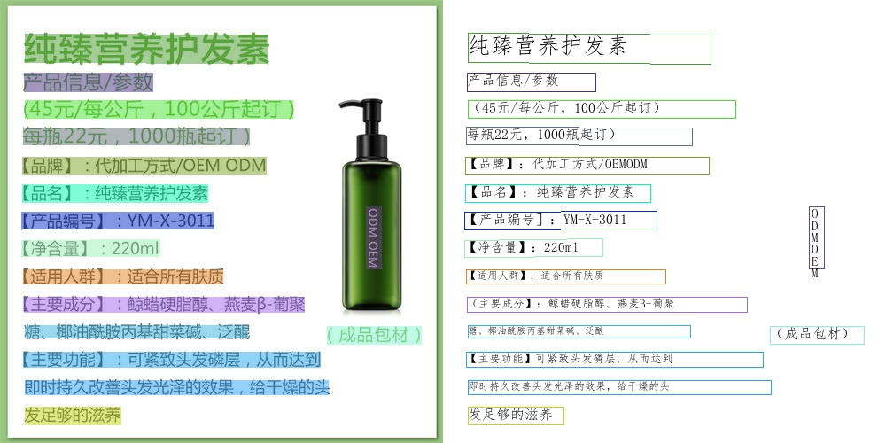

# PP-OCRv2

## 目录

* [PP-OCRv2](#PP-OCRv2)
  * [目录](#目录)
  * [1. 简介](#1-简介)
  * [2. 数据集](#2-数据集)
  * [3. 准备环境与数据](#3-准备环境与数据)
    * [3.1 准备环境](#31-准备环境)
    * [3.2 准备模型与数据](#32-准备模型与数据)
  * [4. 模型转换](#4-模型转换)
    * [4.1 生成FP32 BModel](#41-生成fp32-bmodel)
    * [4.2 生成INT8 BModel](#42-生成int8-bmodel)
  * [5. 推理测试](#5-推理测试)
    * [5.1 环境配置](#51-环境配置)
    * [5.2 C++例程推理](#52-C++例程推理)
    * [5.3 Python例程推理](#53-Python例程推理)
    * [5.4 精度与性能测试](#54-精度与性能测试)
  * [6. 流程化部署](#6-流程化部署)
  * [7. 自动化测试](#7-自动化测试)
  * [8. LICENSE](#8-LICENSE)
  * [9. 参考链接与文献](#9-参考链接与文献)


## 1. 简介

PP-OCRv2，是百度飞桨团队开源的超轻量OCR系列模型，包含文本检测、文本分类、文本识别模型，是PaddleOCR工具库的重要组成之一。支持中英文数字组合识别、竖排文本识别、长文本识别，其性能及精度较PP-OCR均有明显提升。


**参考repo:** [PaddleOCR-release-2.4](https://github.com/PaddlePaddle/PaddleOCR/tree/release/2.4)

**例程特性：**  
- 支持FP32 BModel模型编译及推理；
- 支持batch_size=1、batch_size=4的模型推理；
- 支持文本检测、分类、识别及全流程推理；
- 支持python推理。

## 2. 数据集

暂未找到PP-OCRv2系列模型对应的数据集。

## 3. 准备环境与数据

### 3.1 准备开发环境

模型转换验证和程序编译必须在开发环境中完成，我们需要一台x86主机作为开发环境，并且在我们提供的基于Ubuntu18.04的docker镜像中，使用我们的BMNNSDK3进行模型转换和量化。如果我们的x86主机插有PCIe加速卡可使用PCIe模式，如果没有可使用CModel模式。

- 从宿主机SDK根目录下执行脚本进入docker环境  
```
./docker_run_bmnnsdk.sh
```
- 在docker容器内安装依赖库及和设置环境变量
```
# 在docker容器内执行
cd $REL_TOP/scripts
# 安装库
./install_lib.sh nntc
# 设置环境变量，注意此命令只对当前终端有效，重新进入需要重新执行
source envsetup_pcie.sh    # for PCIE MODE
source envsetup_cmodel.sh  # for CMODEL MODE
```

### 3.2 准备模型与数据

进入本例程的工作目录后，可通过运行`scripts/download.sh`将相关模型下载至`data/models`，将数据集下载并解压至`data/images/`。

```bash
# 下载相关模型与数据
./scripts/download.sh
```

```
下载的模型包括：
ch_PP-OCRv2_det_infer: 文本检测模型
ch_PP-OCRv2_rec_infer: 文本识别模型
ch_ppocr_mobile_v2.0_cls_infer: 文本方向分类模型
下载的数据包括：
ppocr_img: 用于测试的相关图片
```
#### 3.2.1 准备模型

可通过以上方式下载源模型，也可通过[PaddleOCR官网](https://github.com/PaddlePaddle/PaddleOCR/blob/release/2.4/doc/doc_ch/models_list.md)下载相关模型。


#### 3.2.1 准备量化集

待整理

## 4. 模型转换

模型转换的过程需要在x86下的docker开发环境中完成。以下操作均在x86下的docker开发环境中完成。

### 4.1 生成FP32 BModel

进入本例程的工作目录后，可通过运行`scripts/gen_fp32bmodel.sh`，使用bmpaddle编译生成FP32 BModel。请根据实际需求修改`gen_fp32bmodel.sh`中的模型路径、生成模型目录和输入大小shapes等参数。

```bash
./scripts/gen_fp32bmodel.sh
```

上述脚本会在`data/models/fp32bmodel/`下生成多个转换好的bmodel文件，主要包括：
`ch_PP-OCRv2_det_fp32_b1b4.bmodel、ch_ppocr_mobile_v2.0_cls_fp32_b1b4.bmodel、ch_PP-OCRv2_rec_fp32_b1b4.bmodel`，可使用`bm_model.bin --info {path_of_bmodel}`查看的模型具体信息。

```bash
$ bm_model.bin --info data/models/fp32bmodel/ch_PP-OCRv2_rec_fp32_b1b4.bmodel

==========================================
net 0: [PP-OCRv2_rec]  static
------------
stage 0:
input: x, [1, 3, 32, 320], float32, scale: 1
output: save_infer_model/scale_0.tmp_1, [1, 80, 6625], float32, scale: 1
------------
stage 1:
input: x, [4, 3, 32, 320], float32, scale: 1
output: save_infer_model/scale_0.tmp_1, [4, 80, 6625], float32, scale: 1
------------
stage 2:
input: x, [1, 3, 32, 640], float32, scale: 1
output: save_infer_model/scale_0.tmp_1, [1, 160, 6625], float32, scale: 1
------------
stage 3:
input: x, [4, 3, 32, 640], float32, scale: 1
output: save_infer_model/scale_0.tmp_1, [4, 160, 6625], float32, scale: 1
------------
stage 4:
input: x, [1, 3, 32, 1280], float32, scale: 1
output: save_infer_model/scale_0.tmp_1, [1, 320, 6625], float32, scale: 1

```

### 4.2 生成INT8 BModel

待整理

## 5. 推理测试

### 5.1 环境配置

#### 5.1.1 x86 SC5

对于x86 SC5平台，程序执行所需的环境变量执行`source envsetup_pcie.sh`时已经配置完成。

#### 5.1.2 arm SE5
对于arm SE5平台，内部已经集成了相应的SDK运行库包，位于/system目录下，只需设置环境变量即可。

```bash
# 设置环境变量
export PATH=$PATH:/system/bin
export LD_LIBRARY_PATH=$LD_LIBRARY_PATH:/system/lib/:/system/usr/lib/aarch64-linux-gnu
export PYTHONPATH=$PYTHONPATH:/system/lib
```

您可能需要安装numpy包，以在Python中使用OpenCV和SAIL：

```bash
# 请指定numpy版本为1.17.2
sudo pip3 install numpy==1.17.2
```

### 5.2 C++例程推理
(待整理)

### 5.3 Python例程推理

工程目录下的inference/python目录提供了一系列python例程以供参考使用，具体情况如下：

| #  | 例程主文件           | 说明                                          |
| -- | -----------------   | --------------------------------------------  |
| 1  | det_cv_cv_sail.py   | 文本检测，使用OpenCV解码、OpenCV前处理、SAIL推理 |
| 2  | cls_cv_cv_sail.py   | 文本分类，使用OpenCV解码、OpenCV前处理、SAIL推理 |
| 3  | rec_cv_cv_sail.py   | 文本识别，使用OpenCV解码、OpenCV前处理、SAIL推理 |
| 4  | system_cv_cv_sail.py | 文本检测分类识别，使用OpenCV解码、OpenCV前处理、SAIL推理|

- 环境配置

由于Python例程用到sail库，需安装Sophon Inference：

```bash
# 确认平台及python版本，然后进入相应目录，比如x86平台，python3.7
cd $REL_TOP/lib/sail/python3/pcie/py37
pip3 install sophon-*-py3-none-any.whl
```

还需安装其他第三方库：
```bash
# 回到工程目录
cd -
pip3 install -r inference/python/requirements.txt
```

Python代码无需编译，无论是x86 SC5平台还是arm SE5平台配置好环境之后就可直接运行。

> **使用bm_opencv解码的注意事项：** 默认使用原生opencv，若使用bm_opencv解码可能会导致推理结果的差异。若要使用bm_opencv可添加环境变量如下：

```bash
export PYTHONPATH=$PYTHONPATH:$REL_TOP/lib/opencv/x86/opencv-python/
```

出现中文无法正常显示的解决办法：

```bash
# 1.安装中文支持包language-pack-zh-hans
apt install language-pack-zh-hans
# 2.修改/etc/environment，在文件的末尾追加：
LANG="zh_CN.UTF-8"
LANGUAGE="zh_CN:zh:en_US:en"
# 3.修改/var/lib/locales/supported.d/local，没有这个文件就新建，同样在末尾追加：
en_US.UTF-8 UTF-8
zh_CN.UTF-8 UTF-8
zh_CN.GBK GBK
zh_CN GB2312
# 4.最后，执行命令：
locale-gen
```

- 文本检测

主要用于检测图片中文本字段的位置，返回文本字段所在的四边形顶点坐标。

`det_cv_cv_sail.py`的参数说明如下：

```bash
usage:det_cv_cv_sail.py [--tpu_id] [--img_path] [--det_model] [--det_batch_size] [--det_limit_side_len]
--tpu_id: 用于推理的tpu设备id;
--img_path: 输入图片文件夹的路径;
--det_model: 用于推理的文本检测bmodel路径;
--det_batch_size: 模型输入的batch_size，本例程可支持1或4;
--det_limit_side_len: 网络输入尺寸列表，本例程的模型支持960。
```

测试命令：
```bash
python3 inference/python/det_cv_cv_sail.py --tpu_id 0  --img_path data/images/ppocr_img/test --det_model data/models/fp32bmodel/ch_PP-OCRv2_det_fp32_b1b4.bmodel --det_batch_size 4
```
执行完成后，会将预测的可视化结果保存在`./inference_results`文件夹下。


- 文本方向分类

主要用于判断检测并处理后的文本字段是否上下颠倒，若上下颠倒则进行矫正。

`cls_cv_cv_sail.py`的参数说明如下：

```bash
usage:cls_cv_cv_sail.py [--tpu_id] [--img_path] [--cls_model] [--cls_batch_size] [--cls_thresh] [--label_list] 
--tpu_id: 用于推理的tpu设备id;
--img_path: 输入图片文件夹的路径，每张图片仅包含一个文本字段;
--cls_model: 用于推理的文本方向分类bmodel路径;
--cls_batch_size: 模型输入的batch_size，本例程可支持1或4;
--cls_thresh: 文本方向矫正阈值，当预测类别为'180',且预测阈值大于该阈值时才可进行矫正；
--label_list: 文本方向分类的方向列表，本例程默认['0', '180']。
```

测试命令：
```bash
python3 inference/python/cls_cv_cv_sail.py --tpu_id 0  --img_path data/images/ppocr_img/imgs_words/ch --cls_model data/models/fp32bmodel/ch_ppocr_mobile_v2.0_cls_fp32_b1b4.bmodel --cls_batch_size 4 --cls_thresh 0.9 --label_list "0, 180"
```
执行完成后，会打印预测的类别及置信度如下：

```bash
INFO:root:img_name:word_4.jpg, pred:0, conf:0.9999982118606567
INFO:root:img_name:word_5.jpg, pred:0, conf:0.9999988079071045
INFO:root:img_name:word_3.jpg, pred:0, conf:0.9999998807907104
INFO:root:img_name:word_2.jpg, pred:0, conf:0.9999998807907104
INFO:root:img_name:word_1.jpg, pred:0, conf:0.9998781681060791
```

- 文本识别

主要用于对矫正后的文本字段进行内容识别。

`rec_cv_cv_sail.py`的参数说明如下：

```bash
usage:rec_cv_cv_sail.py [--tpu_id] [--img_path] [--rec_model] [--rec_batch_size] [--char_dict_path] [--use_space_char] [--img_size]
--tpu_id: 用于推理的tpu设备id;
--img_path: 输入图片文件夹的路径，每张图片仅包含一个文本字段;
--rec_model: 用于推理的文本识别bmodel路径;
--rec_batch_size: 模型输入的batch_size，本例程可支持1或4;
--char_dict_path: 字符字典文件所在路径；
--use_space_char: 是否识别空格字符；
--img_size: 网络输入尺寸，本例程根据文本长度可支持[320, 32],[640, 32],[1280, 32]三种尺寸，其中[320, 32],[640, 32]可支持batch_size=4的推理。
```

测试命令：
```bash
python3 inference/python/rec_cv_cv_sail.py --tpu_id 0  --img_path data/images/ppocr_img/imgs_words/ch --rec_model data/models/fp32bmodel/ch_PP-OCRv2_rec_fp32_b1b4.bmodel --rec_batch_size 4 --char_dict_path ppocr_keys_v1.txt  --use_space_char True
```
执行完成后，会打印预测的类别及置信度如下：

```bash
INFO:root:img_name:word_4.jpg, conf:0.966046, pred:实力活力
INFO:root:img_name:word_5.jpg, conf:0.980753, pred:西湾监管
INFO:root:img_name:word_3.jpg, conf:0.936186, pred:电话：15952301928
INFO:root:img_name:word_1.jpg, conf:0.997443, pred:韩国小馆
INFO:root:img_name:word_2.jpg, conf:0.994984, pred:汉阳鹦鹉家居建材市场E区25-26号
```

- 全流程测试

进行文本检测、方向分类、文本识别全流程测试，并输出可视化的预测结果。  
`system_cv_cv_sail.py`除了包含`det_cv_cv_sail.py、cls_cv_cv_sail.py、rec_cv_cv_sail.py`的参数外，还包括以下参数：
```bash
usage:system_cv_cv_sail.py [--drop_score] [--use_angle_cls]
--use_angle_cls: 是否进行方向矫正;
--drop_score: 若预测的文本字段置信度小于该阈值则进行舍弃。
```

测试命令：
```bash
python3 inference/python/system_cv_cv_sail.py --use_angle_cls True --drop_score  0.5 
```
执行完成后，会打印预测的字段，同时会将预测的可视化结果保存在`./inference_results`文件夹下。



### 5.4 精度与性能测试
#### 5.4.1 精度测试
待整理
#### 5.4.2 性能测试
待整理
## 6. 流程化部署
(暂无)

## 7. 自动化测试
(待整理)

## 8. LICENSE
本项目的发布受[Apache 2.0 license](LICENSE)许可认证。

## 9. 参考链接与文献
(待整理)